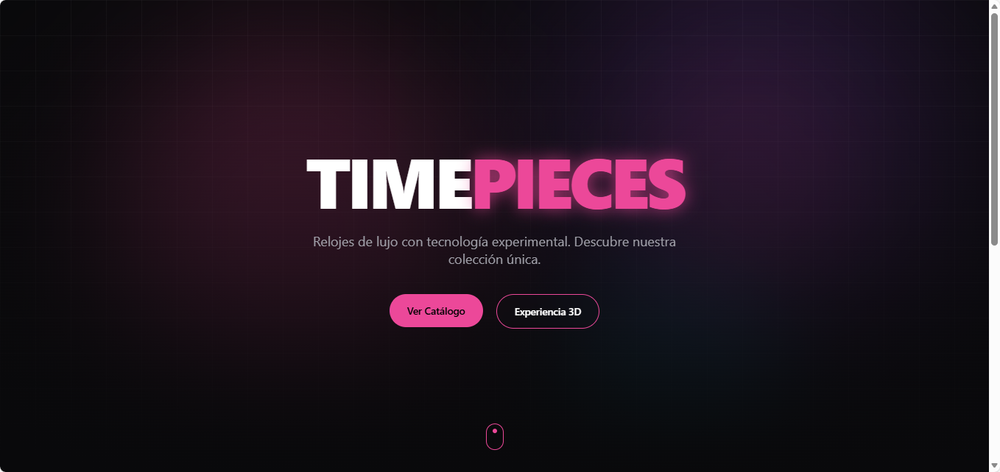
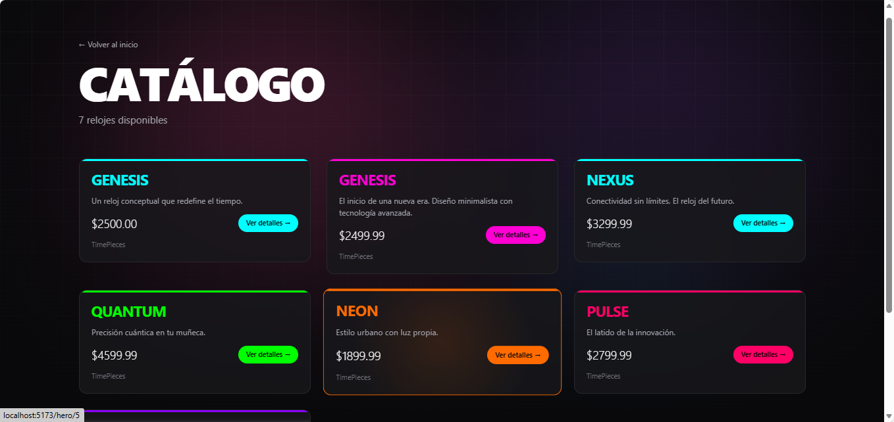
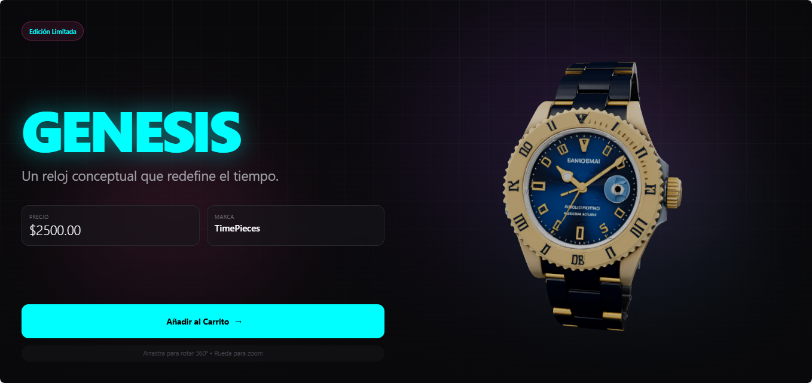

# TimePieces ⌚

**TimePieces** es una aplicación web moderna para la visualización y venta de relojes de lujo con tecnología 3D interactiva. El proyecto combina Django REST Framework en el backend con Vite + React y React Three Fiber en el frontend para ofrecer una experiencia inmersiva de exploración de productos.

---

## 🚀 Características

- ✨ **Visualización 3D Interactiva**: Modelos de relojes renderizados con React Three Fiber
- 🎨 **Diseño Futurista**: Interfaz moderna con animaciones de Framer Motion
- 🌈 **Fondo Animado Interactivo**: Efectos de luz que responden al movimiento del mouse
- 📱 **Responsive**: Adaptado para dispositivos móviles, tablets y desktop
- 🔄 **API RESTful**: Backend robusto con Django REST Framework
- 🐳 **Dockerizado**: Despliegue fácil con Docker Compose
- 🎯 **TypeScript**: Tipado estático para mayor seguridad y mantenibilidad
- ⚡ **Vite**: Build tool ultrarrápido para desarrollo

---

## 🛠️ Stack Tecnológico

### Backend
- **Django 5.x**: Framework web de Python
- **Django REST Framework**: API REST
- **SQLite**: Base de datos (desarrollo)
- **CORS Headers**: Manejo de políticas CORS
- **Pillow**: Procesamiento de imágenes

### Frontend
- **Vite 5.x**: Build tool y dev server ultrarrápido
- **React 18.3**: Biblioteca de interfaz de usuario
- **TypeScript 5.x**: Superset tipado de JavaScript
- **React Router DOM 6.x**: Enrutamiento en el lado del cliente
- **Tailwind CSS 3.x**: Framework de estilos utility-first
- **Framer Motion 11.x**: Biblioteca de animaciones
- **React Three Fiber 8.x**: Renderizado 3D con Three.js
- **React Three Drei 9.x**: Helpers para R3F
- **Three.js 0.161**: Biblioteca 3D

### DevOps
- **Docker & Docker Compose**: Contenedorización
- **Node 20 Alpine**: Imagen ligera para frontend

---

## 📁 Estructura del Proyecto

```
TimePieces/
├── backend/                    # Aplicación Django
│   ├── catalog/               # App principal del catálogo
│   │   ├── management/        # Comandos personalizados
│   │   │   └── commands/
│   │   │       └── seed_watches.py
│   │   ├── migrations/
│   │   ├── models.py          # Modelo Watch
│   │   ├── serializers.py     # Serializadores DRF
│   │   ├── views.py           # ViewSets y vistas
│   │   ├── urls.py
│   │   └── admin.py
│   ├── config/                # Configuración del proyecto
│   │   ├── settings.py
│   │   ├── urls.py
│   │   └── wsgi.py
│   ├── requirements.txt
│   ├── Dockerfile
│   └── db.sqlite3
│
├── frontend/                   # Aplicación Vite + React
│   ├── public/                # Archivos estáticos
│   │   └── watch.glb          # Modelo 3D del reloj
│   ├── src/
│   │   ├── app/               # Páginas de la aplicación
│   │   │   ├── page.tsx       # Landing page
│   │   │   ├── hero/          # Página experimental 3D
│   │   │   │   └── page.tsx
│   │   │   └── catalog/       # Catálogo de relojes
│   │   │       └── page.tsx
│   │   ├── components/        # Componentes React
│   │   │   ├── HeroExperimental.tsx
│   │   │   ├── WatchModel.tsx
│   │   │   └── InfiniteBackground.tsx
│   │   ├── lib/
│   │   │   └── data.ts        # Funciones de fetch API
│   │   ├── App.tsx            # Router principal
│   │   ├── main.tsx           # Punto de entrada
│   │   └── index.css          # Estilos globales
│   ├── package.json
│   ├── tsconfig.json
│   ├── vite.config.ts
│   ├── tailwind.config.js
│   ├── postcss.config.js
│   └── Dockerfile
│
├── docker-compose.yml          # Orquestación de contenedores
└── README.md
```

---

## 🔧 Instalación y Configuración

### Prerrequisitos

- [Docker](https://www.docker.com/get-started) (v20.10+)
- [Docker Compose](https://docs.docker.com/compose/install/) (v2.0+)
- [Git](https://git-scm.com/)

### Clonar el Repositorio

```bash
git clone https://github.com/tu-usuario/timepieces.git
cd timepieces
```

### Levantar el Proyecto con Docker

```bash
docker-compose up --build
```

Este comando:
1. Construye las imágenes de Docker
2. Ejecuta las migraciones de Django
3. Carga datos de ejemplo con `seed_watches`
4. Inicia el servidor de desarrollo de Vite
5. Inicia el servidor de desarrollo de Django

### Acceder a la Aplicación

- **Frontend**: [http://localhost:5173](http://localhost:5173)
- **API Backend**: [http://localhost:8000/api](http://localhost:8000/api)
- **Admin Django**: [http://localhost:8000/admin](http://localhost:8000/admin)

---

## 🗂️ Endpoints de la API

### Catálogo de Relojes

| Método | Endpoint | Descripción |
|--------|----------|-------------|
| GET | `/api/watches/` | Listar todos los relojes |
| GET | `/api/watches/{id}/` | Obtener un reloj específico |
| GET | `/api/hero-watches/` | Obtener relojes marcados como "hero" |
| POST | `/api/watches/` | Crear un nuevo reloj (admin) |
| PUT | `/api/watches/{id}/` | Actualizar un reloj (admin) |
| DELETE | `/api/watches/{id}/` | Eliminar un reloj (admin) |

### Ejemplo de Respuesta

```json
{
  "id": 1,
  "name": "GENESIS",
  "short_description": "El inicio de una nueva era. Diseño minimalista con tecnología avanzada.",
  "price": "2499.99",
  "highlight_color": "#FF00D4",
  "model_3d_url": "/watch.glb",
  "brand": "TimePieces",
  "is_experimental_hero": true
}
```

---

## 🎨 Páginas del Frontend

### 1. Landing Page (`/`)
- Hero section con animaciones de Framer Motion
- Fondo interactivo con efectos de luz
- Botones de navegación al catálogo y experiencia 3D
- Sección de características del producto con efectos hover

### 2. Catálogo (`/catalog`)
- Grid responsive con todos los relojes
- Tarjetas interactivas con animaciones
- Efectos de glow en los colores de cada reloj
- Click en cualquier reloj navega a la vista Hero

### 3. Experiencia Hero (`/hero` o `/hero/:id`)
- Visualización 3D interactiva a pantalla completa
- Modelo 3D con rotación 360° libre
- Controles de zoom y pan
- Split screen: información a la izquierda, modelo 3D a la derecha
- Fondo animado con efectos de luz
- Información completa del producto con precio y marca

---

## 🗄️ Modelo de Datos

### Watch (Reloj)

| Campo | Tipo | Descripción |
|-------|------|-------------|
| `id` | Integer | ID único autogenerado |
| `name` | String(100) | Nombre del reloj |
| `short_description` | Text | Descripción breve |
| `price` | Decimal(10,2) | Precio del producto |
| `highlight_color` | String(7) | Color de acento (hex) |
| `model_3d_url` | String(500) | URL del modelo 3D |
| `brand` | String(100) | Marca del reloj (opcional) |
| `is_experimental_hero` | Boolean | Marca para hero experimental |

---

## 🔨 Comandos Útiles

### Desarrollo Local (Sin Docker)

#### Backend

```bash
cd backend
python -m venv venv
source venv/bin/activate  # Windows: venv\Scripts\activate
pip install -r requirements.txt
python manage.py migrate
python manage.py seed_watches
python manage.py createsuperuser
python manage.py runserver
```

#### Frontend

```bash
cd frontend
npm install
npm run dev
```

### Con Docker

```bash
# Levantar servicios
docker-compose up

# Reconstruir servicios
docker-compose up --build

# Reconstruir sin caché
docker-compose build --no-cache

# Detener servicios
docker-compose down

# Detener y eliminar volúmenes
docker-compose down -v

# Ver logs
docker-compose logs -f

# Ver logs de un servicio específico
docker-compose logs backend
docker-compose logs frontend

# Ejecutar comandos en contenedores
docker-compose exec backend python manage.py createsuperuser
docker-compose exec frontend npm install <paquete>

# Reiniciar un servicio
docker-compose restart backend
docker-compose restart frontend
```

### Agregar Datos de Ejemplo

```bash
docker-compose exec backend python manage.py seed_watches
```

### Crear Superusuario de Django

```bash
docker-compose exec backend python manage.py createsuperuser
```

---

## 📦 Agregar Nuevos Relojes

### Opción 1: Panel de Administración de Django

1. Accede a [http://localhost:8000/admin](http://localhost:8000/admin)
2. Inicia sesión con tu superusuario
3. Ve a "Watches" > "Add Watch"
4. Completa los campos y guarda

### Opción 2: Comando de Seed

Edita `backend/catalog/management/commands/seed_watches.py` y agrega nuevos objetos al array `watches_data`:

```python
{
    'name': 'NUEVO_RELOJ',
    'short_description': 'Descripción del reloj',
    'price': 1999.99,
    'highlight_color': '#FF00FF',
    'brand': 'TimePieces',
    'is_experimental_hero': False,
    'model_3d_url': '/nuevo-modelo.glb'  # Opcional
}
```

Luego ejecuta:

```bash
docker-compose exec backend python manage.py seed_watches
```

### Opción 3: API REST

```bash
curl -X POST http://localhost:8000/api/watches/ \
  -H "Content-Type: application/json" \
  -d '{
    "name": "INFINITY",
    "short_description": "El tiempo infinito en tu muñeca",
    "price": "3999.99",
    "highlight_color": "#FFD700",
    "brand": "TimePieces"
  }'
```

---

## 🎨 Personalización de Estilos

### Colores del Tema

Los colores principales están definidos en `frontend/tailwind.config.js`:

```javascript
export default {
  content: [
    "./index.html",
    "./src/**/*.{js,ts,jsx,tsx}",
  ],
  theme: {
    extend: {
      colors: {
        pink: {
          500: '#ec4899',
        },
        zinc: {
          950: '#09090b',
          900: '#18181b',
          // ...
        }
      }
    },
  },
  plugins: [],
}
```

### Animaciones

Las animaciones están controladas por Framer Motion. Puedes ajustar las configuraciones en cada componente:

```typescript
const itemVariants = {
  hidden: { opacity: 0, y: 20 },
  visible: {
    opacity: 1,
    y: 0,
    transition: {
      duration: 0.6,
      ease: "easeOut",
    },
  },
};
```

### Fondo Animado

Puedes personalizar el fondo en `frontend/src/components/InfiniteBackground.tsx`:

```typescript
// Ajustar colores de las luces
bg-pink-500/30    // Opacidad de las luces
blur-[120px]      // Intensidad del blur

// Ajustar velocidad de animación
duration: 20,     // Segundos por ciclo
```

---

## 🌐 Variables de Entorno

### Backend (opcional - `.env` en `/backend`)

```env
DEBUG=True
SECRET_KEY=tu-clave-secreta
ALLOWED_HOSTS=localhost,127.0.0.1,backend,0.0.0.0
```

### Frontend (`.env` en `/frontend`)

```env
VITE_API_URL=http://localhost:8000/api
```

**Importante**: Las variables de entorno en Vite deben empezar con `VITE_` para ser accesibles en el cliente.

---

## 🚀 Despliegue en Producción

### Frontend (Vercel/Netlify)

```bash
cd frontend
npm run build
npm run preview  # Para probar localmente
```

**Build output**: `frontend/dist/`

Configura la variable de entorno:
- `VITE_API_URL`: URL de tu API en producción

### Frontend (Manual)

```bash
# Construir
cd frontend
npm run build

# Servir con un servidor estático
npm install -g serve
serve -s dist -p 5173
```

### Backend (Railway/Render/Heroku)

1. Configura las variables de entorno:
```env
DEBUG=False
SECRET_KEY=<clave-secreta-aleatoria>
ALLOWED_HOSTS=tu-dominio.com,www.tu-dominio.com
CORS_ALLOWED_ORIGINS=https://tu-frontend.com
```

2. Agrega `gunicorn` a `requirements.txt`

3. Crea un `Procfile`:
```
web: gunicorn config.wsgi --log-file -
```

4. Configura archivos estáticos:
```python
# En settings.py
STATIC_ROOT = BASE_DIR / 'staticfiles'
STATIC_URL = '/static/'
```

---

## 🧪 Testing

### Backend

```bash
# Con Docker
docker-compose exec backend python manage.py test

# Sin Docker
cd backend
python manage.py test
```

### Frontend

```bash
cd frontend
npm run test  # Si tienes tests configurados
npm run lint  # Linting con ESLint
```

---

## 🐛 Troubleshooting

### El frontend no se conecta al backend

1. Verifica que ambos contenedores estén corriendo:
```bash
docker ps
```

2. Verifica la configuración de CORS en `backend/config/settings.py`:
```python
CORS_ALLOW_ALL_ORIGINS = True  # Para desarrollo
```

3. Verifica la variable de entorno `VITE_API_URL` en `frontend/.env`

### El modelo 3D no carga

1. Verifica que `watch.glb` esté en `frontend/public/`
2. Verifica la consola del navegador (F12) para errores
3. Asegúrate que el `model_3d_url` en la base de datos apunte a `/watch.glb`

### Errores de TypeScript

```bash
# Limpia node_modules y reinstala
cd frontend
rm -rf node_modules
npm install

# Reconstruye el contenedor
docker-compose down
docker-compose build --no-cache frontend
docker-compose up
```

### El fondo animado no se ve

1. Verifica que `InfiniteBackground` esté importado en las páginas
2. Asegúrate que tenga `z-0` o `z-index` bajo
3. Verifica la consola para errores de Framer Motion

---

## 🤝 Contribuciones

Las contribuciones son bienvenidas. Por favor:

1. Fork el proyecto
2. Crea una rama para tu feature (`git checkout -b feature/nueva-funcionalidad`)
3. Commit tus cambios (`git commit -m 'Agrega nueva funcionalidad'`)
4. Push a la rama (`git push origin feature/nueva-funcionalidad`)
5. Abre un Pull Request

---

## 📄 Licencia

Este proyecto está bajo la Licencia MIT. Ver el archivo `LICENSE` para más detalles.

---

## 👤 Autor

**Tu Nombre**
- GitHub: [Jordy-Villamil](https://github.com/JordyVillamil)
- Email: jordyvillamilletras@gmail.com

---

## 🙏 Agradecimientos

- [Vite](https://vitejs.dev/) - Build tool ultrarrápido
- [Three.js](https://threejs.org/) - Biblioteca 3D
- [React Three Fiber](https://docs.pmnd.rs/react-three-fiber) - React renderer para Three.js
- [React Three Drei](https://github.com/pmndrs/drei) - Helpers para React Three Fiber
- [Framer Motion](https://www.framer.com/motion/) - Biblioteca de animaciones
- [React Router](https://reactrouter.com/) - Enrutamiento para React
- [Django](https://www.djangoproject.com/) - Framework web de Python
- [Tailwind CSS](https://tailwindcss.com/) - Framework CSS

---

## 📞 Soporte

Si encuentras algún problema o tienes preguntas:

1. Revisa la sección de [Issues](https://github.com/JordyVillamil/timepieces/issues)
2. Crea un nuevo issue con detalles del problema
3. Contacta al equipo de desarrollo

---

## 🗺️ Roadmap

### Implementado ✅
- [x] Migración de Next.js a Vite
- [x] Visualización 3D interactiva con rotación libre
- [x] Fondo animado con efectos de luz
- [x] Navegación fluida entre catálogo y hero
- [x] Click en reloj para ver en 3D
- [x] Diseño responsive
- [x] Animaciones con Framer Motion

### Por Implementar 🚧
- [ ] Carrito de compras funcional
- [ ] Sistema de usuarios y autenticación
- [ ] Integración con pasarela de pagos (Stripe/PayPal)
- [ ] Más modelos 3D de relojes
- [ ] Filtros y búsqueda avanzada en catálogo
- [ ] Sistema de reviews y ratings
- [ ] Dashboard de administración personalizado
- [ ] Notificaciones en tiempo real
- [ ] Modo oscuro/claro
- [ ] Optimización de rendimiento 3D para móviles
- [ ] Wishlist de productos
- [ ] Comparador de relojes
- [ ] Blog de contenido

---

## 📸 Screenshots

### Landing Page

*Página principal con fondo animado interactivo*

### Catálogo

*Grid de relojes con animaciones y efectos hover*

### Vista Hero 3D

*Visualización 3D interactiva con información del producto*

---

## 🔄 Changelog

### v2.0.0 (2024) - Migración a Vite
- ✨ Migración completa de Next.js a Vite
- ✨ Implementación de React Router DOM
- ✨ Nuevo sistema de fondo animado interactivo
- ✨ Mejoras en animaciones con Framer Motion
- ✨ Rotación 360° libre del modelo 3D
- ✨ Split screen en vista Hero
- 🐛 Corrección de problemas de CORS
- 🐛 Corrección de compatibilidad con React Three Fiber
- ⚡ Mejoras significativas en performance

### v1.0.0 (2024) - Release Inicial
- 🎉 Lanzamiento inicial con Next.js
- ✨ Backend Django con API REST
- ✨ Visualización 3D básica
- ✨ Catálogo de productos

---

**Hecho con ❤️ y ⚡ por Jordy Villamil**